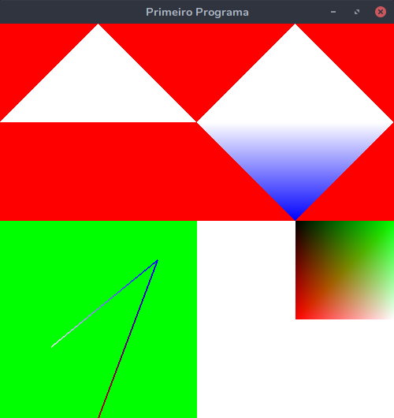

## Trabalho 1 - Computação Gráfica

#### Aluno: Jefferson Alves Costa

##### Como rodar:

instalar "pipenv" no seu linux, navegar ate a pasta do projeto e rodar:
   
    pipenv update
    pipenv run python trabalho1.py

###Resultado:
